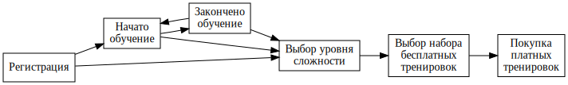

# Анализ уникальных пользовательских путей



Как видно из схемы (а ранее из запросов в базу), после выбора уровня сложности всё просто и линейно, но до этого этапа возможны различные пути.
Позже мы увидим, что и это не совсем так, и между шестью этапами пользователи могут перемещаться многими различныме способами.

Внесём данные о количестве пользователей на разных этапах.  Число внутри блока (этапа) показывает количество уникальных пользователей, которые
этот этап проходили, число рядом со стрелкой — количество пользователей, которые выполнили этот переход.  Поскольку некоторые пользователи могли
проходить этапы более одного раза, суммы чисел на стрелках не всегда будет соответствовать числам внутри блоков:

~~~graphviz
digraph user_paths {
    # stages (or states of our finite automata)
    rankdir="LR";
    node [shape=box fontname="DejaVu Sans-10"];
    edge [fontname="DejaVu Sans-8"];

    REG [label="Регистрация\n 19926", color="red", fontcolor="red"];
    TUTB [label="Начато\nобучение\n 11858", color="green", fontcolor="green"];
    TUTE [label="Закончено\nобучение\n 10250", color="blue", fontcolor="blue"];
    SLVL [label="Выбор уровня\nсложности\n 8342", color="orange", fontcolor="orange"];
    SFREE [label="Выбор набора\nбесплатных\nтренировок\n 5737", color="violet", fontcolor="violet"];
    BUY [label="Покупка\nплатных\nтренировок\n 1600", color="black", fontcolor="black"]

    # Transitions
    REG -> TUTB [color="red", fontcolor="red"];
    REG -> SLVL [label="98", color="red", fontcolor="red"];
    TUTB -> TUTE [label=10250, color="green", fontcolor="green"];
    TUTB -> SLVL [label=743, color="green", fontcolor="green"];
    TUTE -> TUTB [color="blue", fontcolor="blue"];
    TUTE -> SLVL [label=7501, color="blue", fontcolor="blue"];
    SLVL -> SFREE [color="orange", fontcolor="orange"];
    SFREE -> BUY [color="violet", fontcolor="violet"];
}
~~~

> Для начала давайте объединим датафрейм с событиями вместе с датафреймом по
> оплатам. Это позволит анализировать все эти события в рамках одной структуры
> данных.

> Сначала добавим в датафрейм `purchase_df` столбец `event_type`, который будет содержать
> одно значение `purchase`. Это нужно, чтобы в объединенном датафрейме однозначно
> выделить события оплаты.

Нет особого резона тащить лишние поля, поэтому оставлю от каждой таблицы три колонки: `user_id`,
`event_type` и `start_time` (`timestamp`), после чего объединю таблицы и посмотрю, что делать дальше.

```
create view events17_by_uid_time as
select user_id as uid, event_type as event, start_time as tstamp from evts17
union all
select user_id as uid, 'purchase' as event, start_time as tstamp from purs17
order by uid, tstamp;

dgolub=> select count(*) from events17_by_uid_time ;
 count 
-------
 68559 
```

В представлении `events17_by_uid_time` у нас собралась выборка событий, отсортированная по пользователю и времени.
Теперь нужно агрегировать список событий в путь.

Попробуем для этого [функцию STRING_AGG](https://www.postgresql.org/docs/11/sql-expressions.html#SYNTAX-AGGREGATES) из PostreSQL.

```
dgolub=> select STRING_AGG(event, '>' order by tstamp) from events17_by_uid_time group by uid limit 5; 
                                string_agg                                
--------------------------------------------------------------------------
 registration
 registration>tutorial_start>tutorial_finish
 registration>tutorial_start>tutorial_finish
 registration>tutorial_start>tutorial_finish>level_choice>training_choice
 registration>tutorial_start>tutorial_start>tutorial_finish
```

Получается. Теперь нужно сгруппировать эти последовательности событий и выделить самые часто встречающиеся.

```
select 
    count(p.path) as count, 
    p.path 
from (
    select STRING_AGG(event, '>' order by tstamp) as path 
    from events17_by_uid_time group by uid
) as p 
group by p.path 
order by count desc;
```

> Сколько пользователей совершили наиболее популярный путь, ведущий к событию purchase? 
> (для ответа используйте данные пользователей, зарегистрировавшихся в 2017 году)

```
select 
   count(p.path) as count, p.path
from 
   (select STRING_AGG(event, '>' order by tstamp) as path 
    from events17_by_uid_time 
    group by uid)  as p 
where right(p.path,9) = '>purchase' 
group by p.path 
order by count desc limit 5;

 count |                                                       path                                                       
-------+------------------------------------------------------------------------------------------------------------------
  1083 | registration>tutorial_start>tutorial_finish>level_choice>training_choice>purchase
   124 | registration>tutorial_start>level_choice>training_choice>purchase
   101 | registration>tutorial_start>tutorial_finish>level_choice>training_choice>tutorial_start>tutorial_finish>purchase
    52 | registration>tutorial_start>tutorial_finish>tutorial_start>tutorial_finish>level_choice>training_choice>purchase
    26 | registration>tutorial_start>tutorial_start>tutorial_finish>level_choice>training_choice>purchase
```

> Итак, видно, что большинство последовательностей, которые содержат в себе оплату, также содержат старт обучения

Глазам мы верить не будем, а посчитаем.  Для начала сохраним результаты предыдущего этапа во временной 
таблице (можно использовать view, но зачем снова и снова запрашивать то, что можно сохранить, объём данных здесь невелик).

```
dgolub=> create temporary table purchase_paths as
select
   count(p.path) as count, p.path
from 
   (select STRING_AGG(event, '>' order by tstamp) as path 
    from events17_by_uid_time 
    group by uid)  as p 
where right(p.path,9) = '>purchase' 
group by p.path 
order by count desc;

SELECT 115
```

Проверяем, что количество покупок сходится:

```
dgolub=> select sum(count) from purchase_paths;
 sum  
------
  1597
```

Где-то потерялись три пользователя. Возможно, у них покупка была не последним событием?

```
dgolub=> create temporary table purchase_paths_2 as
select
   count(p.path) as count, p.path
from 
   (select STRING_AGG(event, '>' order by tstamp) as path 
    from events17_by_uid_time 
    group by uid)  as p 
-- position returns non-zero if substring present in string --
where position('>purchase' in p.path) > 0 
group by p.path 
order by count desc;

SELECT 118

dgolub=> select sum(count) from purchase_paths_2 ;
 sum  
------
 1600
```

Потерянные пользователи нашлись. Значит, после покупки тоже могут быть события, например, прохождения тренировок.
Удалил временную таблицу `purchase_paths_2` и `purchase_paths`, создал новую `purchase_paths` вторым способом
(через `position`).

Интересно посмотреть пути этих трёх пользователей:

```
dgolub=> select
   count(p.path) as count, p.path
from 
   (select STRING_AGG(event, '>' order by tstamp) as path 
    from events17_by_uid_time 
    group by uid)  as p 
where position('>purchase' in p.path) > 0 and not right(p.path, 9) = '>purchase'
group by p.path 
order by count desc;

 count |                                             path
                                                                               
-------+--------------------------------------------------------------------------------------------
     1 | registration>tutorial_start>tutorial_finish>level_choice>training_choice>tutorial_start>tutorial_finish>tutorial_start>tutorial_finish>purchase>tutorial_start
     1 | registration>tutorial_start>tutorial_finish>tutorial_start>tutorial_finish>level_choice>training_choice>tutorial_start>tutorial_finish>tutorial_start>tutorial_finish>purchase>tutorial_start>tutorial_finis
h
     1 | registration>tutorial_start>tutorial_finish>tutorial_start>tutorial_finish>level_choice>training_choice>tutorial_start>tutorial_finish>tutorial_start>tutorial_start>tutorial_finish>tutorial_start>tutorial
_finish>purchase>tutorial_start>tutorial_finish>tutorial_start>tutorial_finish 
```

Уточним нашу схему:

~~~graphviz
digraph user_paths {
    # stages (or states of our finite automata)
    rankdir="LR";
    node [shape=box fontname="DejaVu Sans-10"];
    edge [fontname="DejaVu Sans-8"];

    REG [label="Регистрация\n 19926", color="red", fontcolor="red"];
    TUTB [label="Начато\nобучение\n 11858", color="green", fontcolor="green"];
    TUTE [label="Закончено\nобучение\n 10250", color="blue", fontcolor="blue"];
    SLVL [label="Выбор уровня\nсложности\n 8342", color="orange", fontcolor="orange"];
    SFREE [label="Выбор набора\nбесплатных\nтренировок\n 5737", color="violet", fontcolor="violet"];
    BUY [label="Покупка\nплатных\nтренировок\n 1600", color="black", fontcolor="black"]
    
    # Transitions
    REG -> TUTB [color="red"];
    REG -> SLVL [label="98", color="red", fontcolor="red"];
    TUTB -> TUTE [label=10250, color="green", fontcolor="green"];
    TUTB -> SLVL [label=743, color="green", fontcolor="green"];
    TUTE -> TUTB [color="blue", fontcolor="blue"];
    TUTE -> SLVL [label=7501, color="blue", fontcolor="blue"];
    SLVL -> SFREE [color="orange"];
    SFREE -> TUTB [color="violet"];
    SFREE -> BUY [color="violet"];
    BUY -> TUTB [label=3, color="black"];
}
~~~

Интересно посчитать, сколько пользователей двигались по тем или иным стрелкам в нашей схеме.  Например, сколько закончивших обучение сразу повторяли его?
Для этого нужно искать определённые фрагменты в путях пользователей.  Но для общей схемы таблица `purchase_paths` не годится, так как в ней речь идёт только
о покупателях.  Создам общую таблицу путей пользователей в системе, включая пути без покупок.

```
create temporary table user_paths as
select
   count(p.path) as count, p.path
from 
   (select STRING_AGG(event, '>' order by tstamp) as path 
    from events17_by_uid_time 
    group by uid)  as p 
group by p.path 
order by count desc;

SELECT 626
```

Пользователи изобретательны: между 6 возможными событиями они прошли 626-ю разными путями (включая регистрацию, за которой ничего не следует).
А сколько пользователей прошло по каждому вектору?

```
select sum(count) from user_paths where position('tutorial_finish>tutorial_start' in path) > 0;
```

Количество пользователей по остальным переходам получается аналогично.

Уточнённый граф:

~~~graphviz
digraph user_paths {
    # stages (or states of our finite automata)
    rankdir="LR";
    node [shape=box fontname="DejaVu Sans-10"];
    edge [fontname="DejaVu Sans-8"];

    REG [label="Регистрация\n 19926", color="red", fontcolor="red"];
    TUTB [label="Начато\nобучение\n 11858", color="green", fontcolor="green"];
    TUTE [label="Закончено\nобучение\n 10250", color="blue", fontcolor="blue"];
    SLVL [label="Выбор уровня\nсложности\n 8342", color="orange", fontcolor="orange"];
    SFREE [label="Выбор набора\nбесплатных\nтренировок\n 5737", color="violet", fontcolor="violet"];
    BUY [label="Покупка\nплатных\nтренировок\n 1600"]

    # Transitions
    REG -> TUTB [label="11858", color="red", fontcolor="red"];
    REG -> SLVL [label="98", color="red", fontcolor="red"];
    
    TUTB -> TUTE [label="10250", color="green", fontcolor="green"];
    TUTB -> SLVL [label="899", color="green", fontcolor="green"];
    TUTB -> SFREE [label=23, color="green", fontcolor="green"];
    TUTB -> BUY [label=51, color="green", fontcolor="green"];
    
    TUTE -> TUTB [label="1776", color="blue", fontcolor="blue"];
    TUTE -> SLVL [label="7345", color="blue", fontcolor="blue"];
    TUTE -> SFREE [label="20", color="blue", fontcolor="blue"];
    TUTE -> BUY [label="213", color="blue", fontcolor="blue"];
    
    SLVL -> TUTB [label="490", color="orange", fontcolor="orange"];
    SLVL -> TUTE [label=18, color="orange", fontcolor="orange"];
    SLVL -> SFREE [label="5694", color="orange", fontcolor="orange"];
    
    SFREE -> TUTB [label=903, color="violet", fontcolor="violet"];
    SFREE -> TUTE [label=18, color="violet", fontcolor="violet"];
    SFREE -> BUY [label=1336, color="violet", fontcolor="violet"];
    
    BUY -> TUTB [label=3];
}
~~~

Если ограничиться только покупателями и смотреть переходы в таблице `purchase_paths`, станут виднее
пути, которые ведут к покупке тренировок:


~~~graphviz
digraph user_paths {
    # stages (or states of our finite automata)
    rankdir="LR";
    node [shape=box fontname="DejaVu Sans-10"];
    edge [fontname="DejaVu Sans-8"];

    REG [label="Регистрация\n 1600", color="red", fontcolor="red"];
    TUTB [label="Начато\nобучение\n1578", color="green", fontcolor="green"];
    TUTE [label="Закончено\nобучение\n1447", color="blue", fontcolor="blue"];
    SLVL [label="Выбор уровня\nсложности\n1600", color="orange", fontcolor="orange"];
    SFREE [label="Выбор набора\nбесплатных\nтренировок\n1600 ", color="violet", fontcolor="violet"];
    BUY [label="Покупка\nплатных\nтренировок\n 1600"]

    # Transitions
    REG -> TUTB [label="1578", color="red", fontcolor="red"];
    REG -> SLVL [label="22", color="red", fontcolor="red"];
    
    TUTB -> TUTE [label="1447", color="green", fontcolor="green"];
    TUTB -> SLVL [label="159", color="green", fontcolor="green"];
    TUTB -> BUY [label=51, color="green", fontcolor="green"];
    TUTB -> SFREE [label="4", color="green", fontcolor="green"];
    
    TUTE -> SLVL [label="1419", color="blue", fontcolor="blue"];
    TUTE -> BUY [label="213", color="blue", fontcolor="blue"];
    TUTE -> TUTB [label="195", color="blue", fontcolor="blue"];
    TUTE -> SFREE [label="9", color="blue", fontcolor="blue"];
    
    SLVL -> SFREE [label="1587", color="orange", fontcolor="orange"];
    SLVL -> TUTB [label="9", color="orange", fontcolor="orange"];
    SLVL -> TUTE [label="4", color="orange", fontcolor="orange"];
    
    SFREE -> BUY [label=1336, color="violet", fontcolor="violet"];
    SFREE -> TUTB [label="258", color="violet", fontcolor="violet"];
    SFREE -> TUTE [label="6", color="violet", fontcolor="violet"];
    
    BUY -> TUTB [label=3];
}
~~~

Что интересного видно из этих схем переходов?

* Прохождение обучения — важный этап на пути к покупке тренировок. Но на этапах от прохождения обучения до выбора 
  уровня сложности и особенно от выбора сложности до выбора бесплатных тренировк теряется много пользователей.

* Все покупатели выбирали уровень сложности и проходили бесплатные тренировки.
* Переход от регистрации сразу к выбору уровня сложности имеет аномально высокую конверсию: из 98 пользователей
  выполнивших этот переход, образовалось 22 покупателя.
* Если пользователь дошёл до выбора бесплатных тренировок, есть высокий шанс покупки (около 28%). Важно пользователя до этого
  этапа довести, не потерять по дороге.

