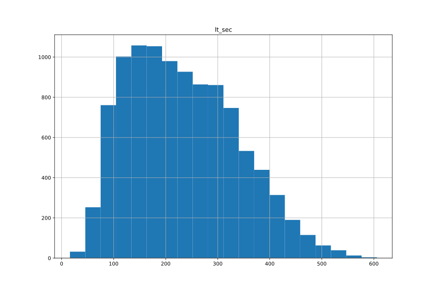

# Анализ времени прохождения этапов

## представление "время регистрации"

```
dgolub=> select user_id, start_time as registration_time from evts17 where event_type='registration' limit 4;
 user_id |  registration_time  
---------+---------------------
   27832 | 2017-01-01 03:48:40
   27833 | 2017-01-01 04:07:25
   27834 | 2017-01-01 08:35:10
   27835 | 2017-01-01 11:54:47
```

Сохраняем в представлении:

```
dgolub=> create view c8_registration_ts as
dgolub-> select user_id, start_time as registration_ts from evts17 where event_type='registration';
CREATE VIEW
```

## Представление "начало обучения"

Аналогично для начала обучения. Тут нас ждёт подводный камень: многие пользователи начинают обучение больше одного раза.
Поэтому применим группировку по пользователям и выберем минимальную отметку времени (получится первое начало обучения).

```
dgolub=> select user_id, min(start_time) as tut_start_ts from evts17 where event_type='tutorial_start' group by user_id order by min(start_time) limit 4;

 user_id |    tut_start_ts     
---------+---------------------
   27836 | 2017-01-01 14:54:40
   27835 | 2017-01-01 15:00:51
   27833 | 2017-01-01 17:47:40
   27839 | 2017-01-01 19:11:36
```

```
dgolub=> create view c8_tutorial_start_ts as
dgolub-> select user_id, min(start_time) as tut_start_ts from evts17 where event_type='tutorial_start' group by user_id order by min(start_time);
CREATE VIEW
```

Учебник рекомендует ещё сохранить `tutorial_id`, добавим его в представление, но как? При каждом начале обучения формируется новый `tutorial_id`.
Заметим, что эти ID возрастают. Пример запроса, в выдаче которого видно возрастание Tutorial ID:

```
dgolub=> select user_id, start_time as tut_start, tutorial_id from evts17
where event_type='tutorial_start' and 
user_id in (
   select user_id from evts17 where event_type='tutorial_start' group by user_id having count(tutorial_id) > 5 
) 
limit 40;
```

Значит, как и со временем начала обучения (`start_time`), для исключения многозначности достаточно будет взять минимальный `tutorial_id`;

```
drop view c8_tutorial_start_ts;
DROP VIEW

dgolub=> create view c8_tutorial_start_ts as
dgolub-> select user_id, min(start_time) as tut_start_ts, min(tutorial_id) as tut_id from  evts17 where event_type='tutorial_start' group by user_id;
CREATE VIEW

dgolub=> select * from c8_tutorial_start_ts limit 6;
 user_id |    tut_start_ts     | tut_id 
---------+---------------------+--------
   44127 | 2017-11-07 20:29:47 |  46257
   39224 | 2017-07-26 06:33:18 |  41958
   30052 | 2017-02-13 21:48:59 |  33554
   37083 | 2017-06-14 05:49:57 |  39977
   37876 | 2017-06-26 17:33:33 |  40757
   31297 | 2017-03-06 22:19:58 |  34655
```

## Окончание обучения

Сначала поступим по-простому: выделим время окончания обучения для пользователей:

```
dgolub=> select user_id, start_time as tut_finish_ts from evts17 where event_type='tutorial_finish' limit 40;
 user_id |    tut_finish_ts    
---------+---------------------
   27835 | 2017-01-01 15:06:15
   27836 | 2017-01-01 15:42:58
   ...
```

В получившемся списке видно, что по крайней мере некоторые пользователи заканчивали обучение больше одного раза, 
ну и из предыдущего изучения `tutorial_start` это более-менее очевидно.  А сколько раз можно было закончить
обучение?

```
dgolub=> select user_id, count(start_time) from evts17 where event_type='tutorial_finish' group by user_id order by count(start_time) desc limit 5;
 user_id | count 
---------+-------
   43890 |     9
   36305 |     9
   44532 |     9
   33775 |     9
   35713 |     9
```

Просто взять самое раннее окончание обучения не получается, так как нам нужно расчитать время прохождения обучения.  Но есть поле `tutorial_id`, и в созданном
ранее представлении `c8_tutorial_start_ts` тоже есть `tutorial_id`.  Можем выделить тех пользователей, которые закончили первое начатое обучение,
сопоставляя `tutorial_id` в представлении `c8_tutorial_start_ts` и в `evts17`.

```
dgolub=> select user_id, start_time as tut_finish_ts, tutorial_id as tut_id from evts17 where event_type='tutorial_finish' and tutorial_id in (select tut_id from c8_tutorial_start_ts) limit 5;
 user_id |    tut_finish_ts    | tut_id 
---------+---------------------+--------
   27835 | 2017-01-01 15:06:15 |  31506
   27833 | 2017-01-01 17:50:08 |  31508
   27839 | 2017-01-01 19:16:32 |  31509
   27834 | 2017-01-01 19:48:01 |  31510
   27845 | 2017-01-02 03:06:48 |  31512
```

Сравнивая количество пользователей в представлении `c8_tutorial_start_ts` (11858)  и результатах получившегося запроса (9830), видна большая потеря пользователей.
Возможно, надо сопоставлять окончание обучения с его началом до группировки по пользователям? Проверим.

Сколько мы можем найти уникальных пользователей, у которых существует пройденное от начала до конца обучение?
```
dgolub=> select count(distinct tf.user_id) as uids
from
(select user_id, start_time as tut_start_ts, tutorial_id as tut_id from evts17 where event_type='tutorial_start' order by user_id, start_time) as ts
inner join
(select user_id, start_time as tut_finish_ts, tutorial_id as tut_id from evts17 where event_type='tutorial_finish' order by user_id, start_time) as tf
using (user_id, tut_id);
 uids  
-------
 10250
```

Число согласуется с полученными ранее.  А не уникальных (убрал `distinct`) получается 14904, поэтому снова применим группировку и выделение самого раннего
из пройденных обучений.  Как и ранее, запишем результат во view:

```
create view c8_tutorial_time as
select tf.user_id as uid, min(ts.tut_start_ts) as tut_start_ts, min(tf.tut_finish_ts) as tut_finish_ts, (min(tf.tut_finish_ts) - min(ts.tut_start_ts)) as learn_time
from
    (select user_id, start_time as tut_start_ts, tutorial_id as tut_id from evts17 where event_type='tutorial_start' order by user_id, start_time) as ts
    inner join
    (select user_id, start_time as tut_finish_ts, tutorial_id as tut_id from evts17 where event_type='tutorial_finish' order by user_id, start_time) as tf
using (user_id, tut_id)
group by uid
order by uid;


dgolub=> select * from c8_tutorial_time limit 5;
  uid  |    tut_start_ts     |    tut_finish_ts    | learn_time 
-------+---------------------+---------------------+------------
 27833 | 2017-01-01 17:47:40 | 2017-01-01 17:50:08 | 00:02:28
 27834 | 2017-01-01 19:46:11 | 2017-01-01 19:48:01 | 00:01:50
 27835 | 2017-01-01 15:00:51 | 2017-01-01 15:06:15 | 00:05:24
 27836 | 2017-01-01 15:40:43 | 2017-01-01 15:42:58 | 00:02:15
 27839 | 2017-01-01 19:11:36 | 2017-01-01 19:16:32 | 00:04:56
```

У нас образовалась колонка со временем прохождения обучения.  Посчитаем по ней некоторые показатели:

```
dgolub=> select avg(learn_time) from c8_tutorial_time;
       avg       
-----------------
 00:03:52.931512
 
dgolub=> select percentile_cont(0.5) within group (order by learn_time) from c8_tutorial_time;
  percentile_cont 
 -----------------
         00:03:42

dgolub=> select max(learn_time) from c8_tutorial_time;
   max    
----------
 00:10:06

dgolub=> select min(learn_time) from c8_tutorial_time;
   min    
----------
 00:00:16
 
dgolub=> select percentile_cont(0.8) within group (order by learn_time) from c8_tutorial_time;
 percentile_cont 
-----------------
 00:05:26
```

Среднее время прохождения обучения и медианное время очень близки, и 80% пользователей проходят
обучение менее, чем за пять с половиной минут.

Каково же распределение времени обучения?  Тут нам понадобится Python для  создания гистограммы:



## А8.5.7 Самостоятельная работа:

> Определите для пользователей, зарегистрировавшихся в 2017 году, следующие параметры:

> * Сколько в среднем для всех пользователей проходит времени между событием выбора уровня сложности тренировки до события выбора набора бесплатных тренировок?
> * Сколько в среднем для всех пользователей проходит времени между событием выбора набора бесплатных тренировок и первой оплатой?

### Время от выбора уровня сложности до выбора набора бесплатных тренировок

```
dgolub=> select count(user_id) from evts17 where event_type='level_choice';
 count 
-------
  8342

dgolub=> select count(distinct user_id) from evts17 where event_type='level_choice';
 count 
-------
  8342
```

Один выбор — один пользователь. Прекрасно.  Аналогично для выбора бесплатных тренировок:


```
dgolub=> select count(user_id) from evts17 where event_type='training_choice';
 count 
-------
  5737

dgolub=> select count(distinct user_id) from evts17 where event_type='training_choice';
 count 
-------
  5737
```

Снова соотношение 1:1, поэтому две выдачи можно соединять по user_id в качестве ключа.

```
dgolub=> select user_id, lc_ts, tc_ts, (tc_ts - lc_ts) as time_diff from
(select user_id, start_time as lc_ts from evts17 where event_type='level_choice') as lc
inner join
(select user_id, start_time as tc_ts from evts17 where event_type='training_choice') as tc
using (user_id)  limit 5;

 user_id |        lc_ts        |        tc_ts        | time_diff 
---------+---------------------+---------------------+-----------
   27835 | 2017-01-01 20:37:22 | 2017-01-01 20:38:43 | 00:01:21
   27839 | 2017-01-01 22:37:50 | 2017-01-01 22:42:54 | 00:05:04
   27845 | 2017-01-02 06:19:18 | 2017-01-02 06:25:12 | 00:05:54
   27849 | 2017-01-02 11:53:11 | 2017-01-02 11:59:26 | 00:06:15
   27843 | 2017-01-02 14:09:58 | 2017-01-02 14:14:51 | 00:04:53
```

Сохраню результат как представление и посчитаю среднее и квартили.

```
dgolub=> select avg(time_diff) from c8_tc_lc_time_diff;
       avg       
-----------------
 00:05:17.128464
 
dgolub=> select percentile_cont(0.5) within group (order by time_diff) from c8_tc_lc_time_diff;
 percentile_cont 
-----------------
 00:04:57
```

Судя по тому, что среднее слегка больше медианы, у распределения есть правый «хвост».

Представление нам больше не нужно.

```
dgolub=> drop view c8_tc_lc_time_diff;
DROP VIEW
```


### Время между выбором бесплатных тренировок и первой оплатой

```
dgolub=> select user_id, tc.tc_ts, purs.pur_ts, (purs.pur_ts - tc_ts) as time_diff from
(select user_id, start_time as tc_ts from evts17 where event_type='training_choice') as tc
join
(select user_id, start_time as pur_ts from purs17) as purs
using (user_id) limit 5;

 user_id |        tc_ts        |       pur_ts        |    time_diff    
---------+---------------------+---------------------+-----------------
   27845 | 2017-01-02 06:25:12 | 2017-01-03 18:53:43 | 1 day 12:28:31
   27865 | 2017-01-04 06:03:20 | 2017-01-04 14:46:10 | 08:42:50
   27884 | 2017-01-04 16:22:03 | 2017-01-08 19:37:34 | 4 days 03:15:31
   27910 | 2017-01-05 12:05:28 | 2017-01-07 12:11:34 | 2 days 00:06:06
   27911 | 2017-01-05 17:40:37 | 2017-01-07 08:19:12 | 1 day 14:38:35
```

Представление, конечно, можно не создавать, но запросы получаются громоздкими. Например, для среднего:

```
select avg(purs.pur_ts - tc_ts) as avg_time_diff, percentile_cont(0.5) within group (order by (purs.pur_ts - tc_ts)) as median_time_diff from
(select user_id, start_time as tc_ts from evts17 where event_type='training_choice') as tc
join
(select user_id, start_time as pur_ts from purs17) as purs
using (user_id);

     avg_time_diff      | median_time_diff  
------------------------+-------------------
 3 days 17:46:53.403125 | 3 days 12:51:25.5
```

Среднее снова немного больше медианы.
